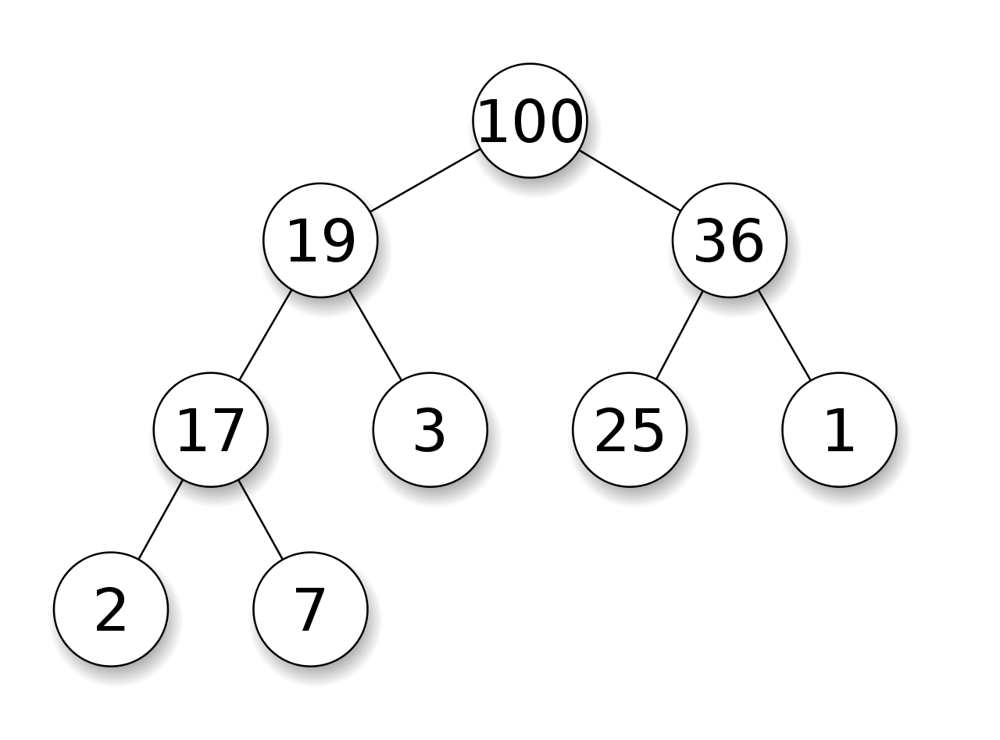

# Heapsort

Heapsort é um algorítmo de ordenação estável, com um desempenho em tempo de execução muito bom.

Basicamente sua ideia trata-se de encontrar o maior valor presente no vetor, posiciona-lo no final e repetir esse processo até que tudo esteja ordenado.

Ele utiliza uma estrutura de dados chamada heap (árvore binária), para ordenar os elementos. 

Imagem representativa de uma heap:

Podemos representar uma heap com um vetor, e a ideia será criarmos uma heap para cada interação na lista e realizar o processo de localizar o maior elemento e e então posicioná-lo no final da lista.

